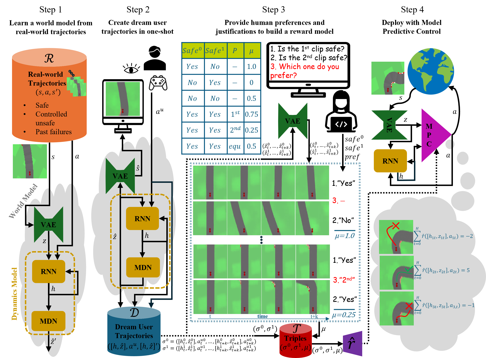
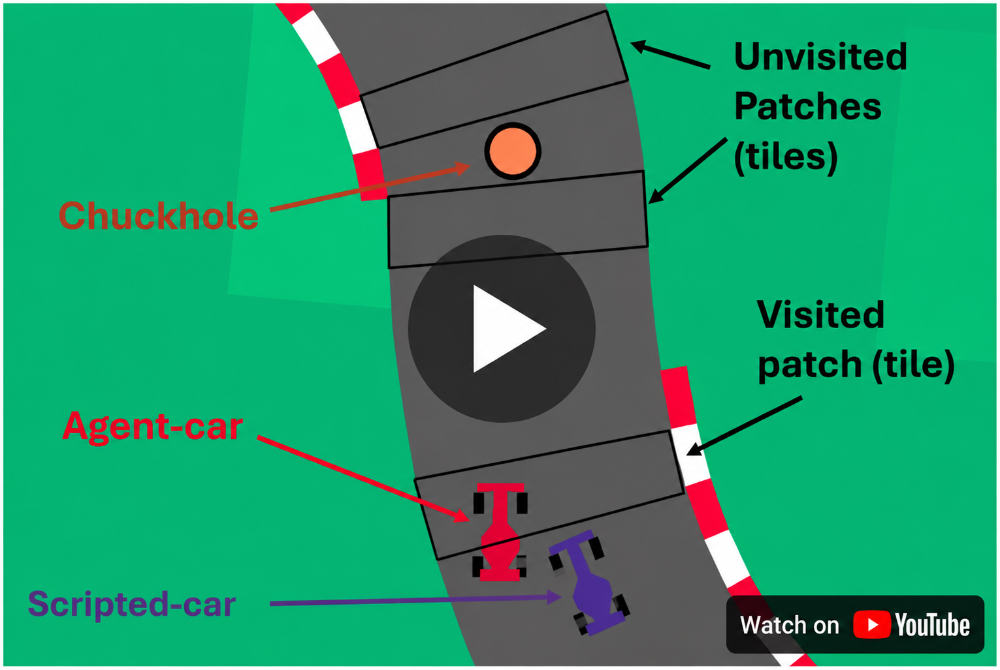
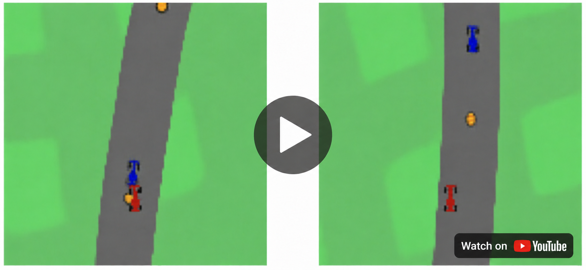
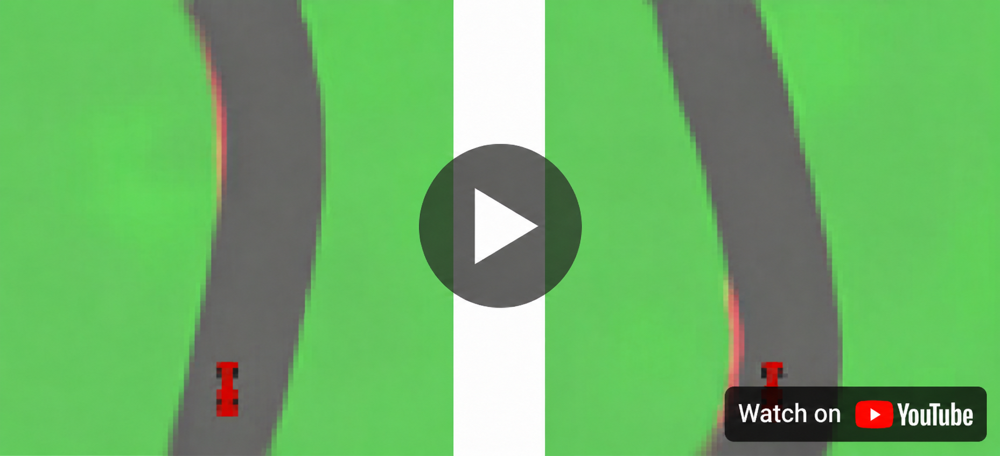
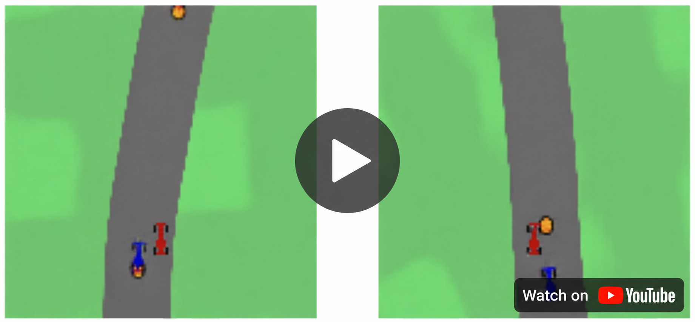
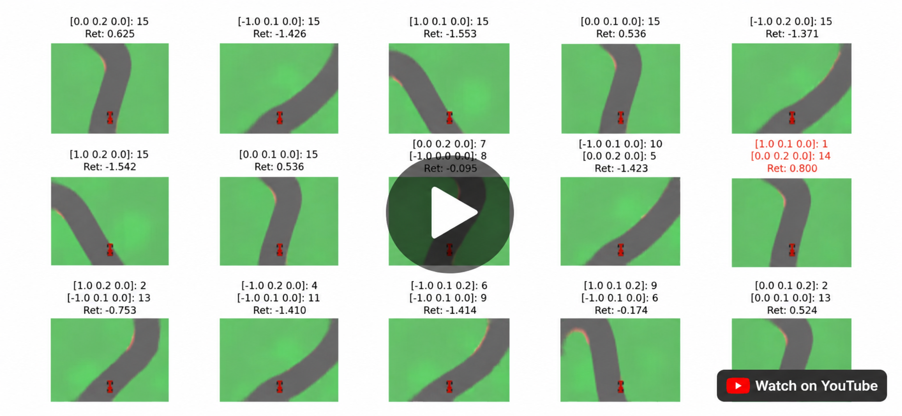

# DROPJ: Dream-World Reward Learning from Human Preferences and Justifications

This repository contains code for the ICAART 2026 paper:
**["Safe Reward Learning from Human Preferences and Justifications"](https://www.scitepress.org/Papers/2026/144087/144087.pdf)**.

<p align="center">
  
</p>

### **DROPJ Algorithm**

**Step 1:** Learn a world model from real-world trajectories

**Step 2:** Create dream user trajectories in *one-shot*

**Step 3:** Learn a reward model from user preferences and *justifications*

**Step 4:** Deploy with Model Predictive Control

## Example Videos

DROPJ demo video with examples during deployment:

<a href="https://youtu.be/3JfrS6mRBW4">
  
</a>

Full clips corresponding to the paper figures:

| Paper figure | Description | Video |
|---|---|---|
| Fig. 7 | Multiple justifications case – example 1 | [](https://youtu.be/WRlA0LZk3gA) |
| Fig. 11 | Single safety justification case | [](https://youtu.be/WuX-aSXezp0) |
| Fig. 12 | Multiple justifications case – example 2 | [](https://youtu.be/Ea-b6F82DE4) |
| Fig. 13 | Model Predictive Control dreams | [](https://youtu.be/O_5QIFdOgec) |

---

## Installation

The code was tested with the following versions:
- Python 3.8.19
- PyTorch 1.9.0
- Gym 0.20.0
- box2d-py 2.3.5
- NumPy 1.19.2
- CUDA Toolkit 10.2.89

> **Note:** `box2d-py` may require manual installation on some systems (e.g. via pip or conda-forge).
> The provided `dropj.yml` contains the full environment for reproducibility.

You may try using `gymnasium` instead of `gym`. Minor adjustments might be needed (e.g. file paths and environment naming), but functionality is expected to remain equivalent.

After setting up the environment:

- **For Car Racing:**
  Replace the installed `car_racing.py` file in your Gym (or Gymnasium) installation with `install/car_racing.py`.

- **For Obstacle Car Racing:**
  1. Copy `install/obst_car_racing.py` and `install/obst_car_dynamics.py` into the `gym/envs/box2d/` (or equivalent) directory of your Gym (or Gymnasium) installation.
  2. Register the environment by adding the following line to `gym/envs/box2d/__init__.py`:
     ```python
     from gym.envs.box2d.obst_car_racing import ObstCarRacing
     ```

---

## Usage

### Car Racing

#### `dropj.py`
Implements DROP, DROPe, and DROPJ:
- Set any of the flags at the beginning to do a step of DROPJ from scratch:
`DO_STEP1_FROM_SCRATCH`
`DO_STEP2_FROM_SCRATCH`
`DO_STEP3_FROM_SCRATCH`
- If `DO_STEP1_FROM_SCRATCH = True`, set the following to extract real-world user trajectories from scratch:`EXTRACT_RAW_USER_ROLLOUT`.
Otherwise, unzip compressed `raw_user_rollouts*.pkl` file and use pre-collected `raw_user_rollouts*.pkl` (Attention with large uncompressed sizes -- see below "**Attention - large uncompressed size**")
- If `DO_STEP3_FROM_SCRATCH = True`, set the following to create new preference queries:`CREATE_NEW_QUERIES`.
- `extract_user_trajs()` creates real-world trajectories (trajectories $\mathcal{R}$), used to train the VAE (encoder) in `vae_model.py` and MDN-RNN (dynamics model) in `dynamics_model.py`
    - Recommended to generate in batches to avoid memory issues
- `extract_dream_user_trajs()` creates dream trajectories (trajectories $\mathcal{D}$)
- Preference queries can be created with `create_pref_queries()`
- Use `pref_gui.py` to provide preferences and justifications
- Train the reward model using `reward_model.learn_with_GUI()`
- The trained world model and reward models are provided for direct evaluation

**To select variants:**
- **DROP:** `use_justifications=False`, `use_equal_in_plain_prefs=False`
- **DROPe:** `use_justifications=False`, `use_equal_in_plain_prefs=True`
- **DROPJ:** `use_justifications=True` (second flag arbitrary)

#### `pref_gui.py`
GUI for collecting preferences and justifications used in DROP/DROPe/DROPJ.

#### `request.py` and `eval_request.py`
Implements and evaluates **ReQueST**:
- Generation of trajectory segments and user feedback in iterative feedback sessions
- Requires `default_init_obses_ep600enc_15.pkl` as input
- Builds reward model using sparse user feedback in `reward_model_sparse.py`

#### `dros.py` and `eval_dros.py`
Implements and evaluates **DROS**:
- Segments generated from `dream_user_rollouts.pkl`
- **One-shot** collection of responses and reward model training, again from sparse labels via `reward_model_sparse.py`

---

### Obstacle Car Racing


#### `obst_dropj.py`
Implements DROPJ with *multiple justifications*:
- Flags to do Steps from scratch, `extract_user_trajs()`, `extract_dream_user_trajs()`, and `create_pref_queries()` are similar to Car Racing
- Use `obst_pref_gui.py` to provide preferences with multiple justifications
- Train the reward model using `reward_model.learn_with_GUI_multi_justs()`

**Selecting obstacle variants:**

Set the obstacle mode in `obst_dropj.py`:

```python
OBST_MODE = 'chuckc'       # only chuckholes
# OR
OBST_MODE = 'chuckccar'    # chuckholes and cars
```

Configure the appropriate flags in `obst_car_racing.py`:

```python
# for 'chuckc' mode
ONLY_CHUCKHOLES = True
CHUCKHOLES_CARS = False

# for 'chuckccar' mode
ONLY_CHUCKHOLES = False
CHUCKHOLES_CARS = True
```


**Using justification weights:**

Use different justification weights prioritising specific safety aspects.

```python
if OBST_MODE == 'chuckc':
    # Prioritising chuckholes avoidance
    w_def = 0.75
    w_grass = 0.95
    w_chuck = 1.0
    just_weights = {
        'Default': w_def,
        'Grass': w_grass,
        'Chuckhole': w_chuck
    }
    
    # Prioritising grass avoidance
elif OBST_MODE == 'chuckccar':
    w_def = 1.0
    w_grass = 1.0
    w_chuck = 0.98
    w_car = 0.98
    just_weights = {
        'Default': w_def,
        'Grass': w_grass,
        'Chuckhole': w_chuck,
        'Car': w_car
    }
```


#### `obst_pref_gui.py`
GUI for collecting preferences and justifications used in DROPJ with multiple justifications.

---


## Data Availability

<!-- We provide here a minimal test version of our data and models, sufficient to verify basic reproducibility and functionality. -->

All data and pretrained models are available in the dataset of the project at [Project Dataset (DOI: 10.5258/SOTON/D3749)](https://doi.org/10.5258/SOTON/D3749). 

You can either use the provided data and pretrained models or extract everything from scratch based on the flags described above. 

For more details please refer to `README_DROPJ-DATA.txt` included in the dataset repository.


⚠️ Attention - large uncompressed size
-------------------------------------
The following archives from the dataset are small to download, but expand to tens of gigabytes when extracted:  
	- raw_user_rollouts_res84_ep600.zip -> ~25 GB after extraction  
	- raw_user_rollouts_res128_ep600_chuckcobst.zip -> ~59 GB after extraction  
	- raw_user_rollouts_res128_ep800_chuckccarobst.zip -> ~79 GB after extraction

If you have limited space in disk, you can either use the pretrained VAE and MDN-RNN models, or extract less trajectories following STEP 1 in `dropj.py` or `obst_dropj.py`.

> **Docs note:** Docstrings were AI-drafted and then reviewed and tested by the author.

